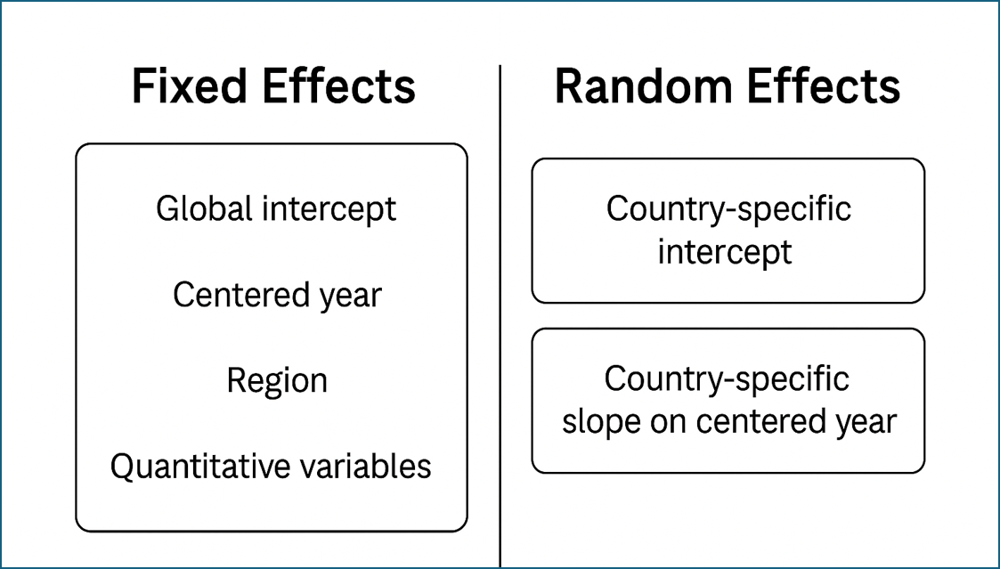

# Happiness Scores – Linear Mixed Models

This project applies **Linear Mixed Models (LMM)** to happiness data from the **World Happiness Report**, capturing both **global trends** and **country-level differences**.

## 📊 Model Structure

The diagram below summarizes the fixed and random effects modeled:

## 🛠 Tools Used

- **R**: `lme4`, `ggplot2`, `tidyverse`
- **Quarto**: for reproducible and styled HTML output
